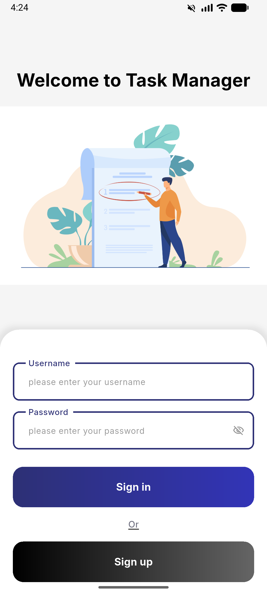
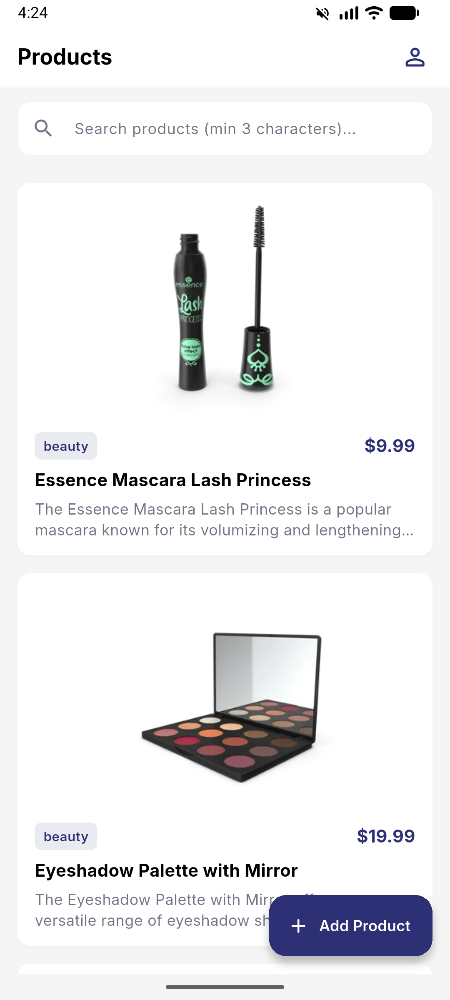
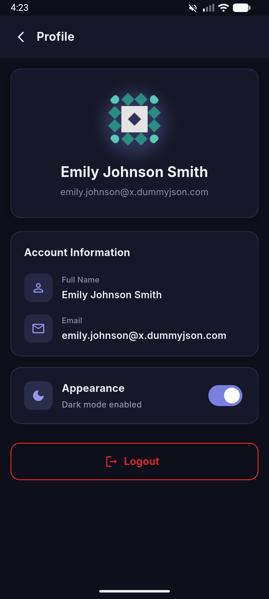
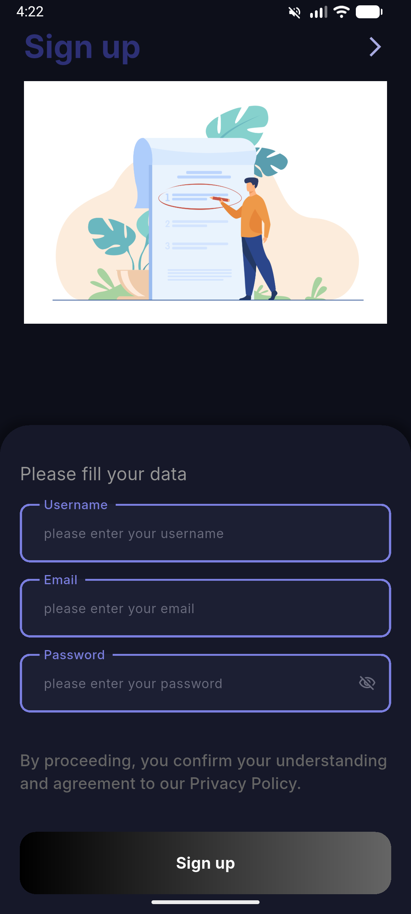
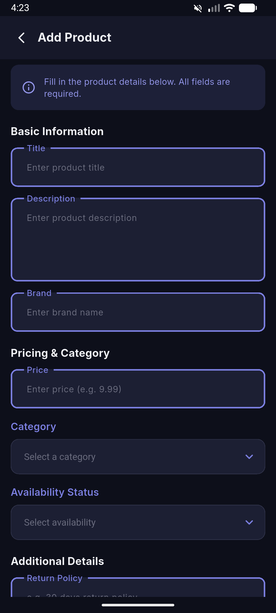

# Task Manager

A Flutter product catalog app built with **Clean Architecture**. Users can sign in, browse and search products, view details, add new items, and manage their profile — with light/dark theme support. Powered by the [DummyJSON](https://dummyjson.com/) API.

## Screenshots

| Login | Products | Profile |
|:---:|:---:|:---:|
|  |  |  |

| Sign up | Add Product |
|:---:|:---:|
|  |  |

## How to Run

```bash
flutter pub get
flutter run
```

> If you modify models or API code, regenerate files first:
> `dart run build_runner build --delete-conflicting-outputs`

**Requirements:** Flutter SDK `^3.11.5`, Dart `^3.11.5`

## Dependencies

| Package | Purpose |
|---|---|
| `flutter_bloc` | State management |
| `dio` + `retrofit` | HTTP networking |
| `get_it` | Dependency injection |
| `freezed` + `json_annotation` | Immutable models & serialization |
| `shared_preferences` + `flutter_secure_storage` | Local & secure storage |
| `cached_network_image` | Image caching |
| `flutter_screenutil` | Responsive UI |
| `lottie` | Animations |
| `fluttertoast` | Toast messages |
